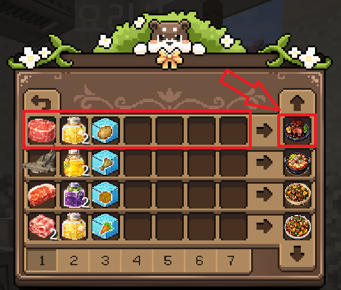

# 🧑‍🍳 요리

요리는 다양한 재료를 조합하여 음식을 만드는 시스템입니다.\
요리사 **달콩**을 우클릭하거나, `/원격요리`(대장 등급) 명령어로 요리 메뉴를 열 수 있습니다.

<figure><figcaption></figcaption></figure>

## 사용 방법

<figure><figcaption></figcaption></figure>

1. 요리 메뉴에서 원하는 **레시피**를 선택합니다.
2. 필요한 **재료**가 인벤토리에 있는지 확인합니다.
3. 재료가 충분하면 **조리 시작** 버튼을 눌러 대기열에 등록합니다.
4. 조리 시간이 지나면 완성된 요리를 받을 수 있습니다.

### 대기열 슬롯

요리 대기열 슬롯은 [등급](../ranks.md)에 따라 해금됩니다.

| 등급      | 대기열 슬롯 |
| ------- | ------ |
| 아기 · 꼬마 | 1칸     |
| 의젓      | 3칸     |
| 듬직      | 6칸     |
| 대장      | 9칸     |


슬롯이 많을수록 여러 요리를 동시에 대기열에 넣을 수 있습니다.


## 레시피 목록

### S등급

|                                                          | 요리             | 재료                              | 조리 시간 |
| -------------------------------------------------------- | -------------- | ------------------------------- | ----- |
|  | 한우 안심 스테이크     | 한우 안심 x1, 마늘 기름 x2, \[압축]감자 x3  | 200초  |
|      | 상어 수제비 전골      | 귀상어 x1, 옥수수 기름 x2, \[압축]건초더미 x3 | 200초  |
|   | 한우 등심 호박찜      | 한우 등심 x1, 가지 기름 x2, \[압축]호박 x3  | 180초  |
|                                                          | 청새치 가지 수박 그릴   | 청새치 x1, 가지 기름 x2, \[압축]수박 블록 x3 | 200초  |
|                                                          | 대왕가오리 호박 포도 솥밥 | 대왕가오리 x1, 포도 기름 x2, \[압축]호박 x3  | 220초  |

### A등급

|                                                          | 요리          | 재료                            | 조리 시간 |
| -------------------------------------------------------- | ----------- | ----------------------------- | ----- |
|  | 차돌박이 마늘 볶음  | 차돌박이 x2, 마늘 기름 x1, \[압축]당근 x4 | 120초  |

### B등급

|                                                           | 요리            | 재료                                | 조리 시간 |
| --------------------------------------------------------- | ------------- | --------------------------------- | ----- |
|  | 삼겹살 양배추 구이    | 삼겹살 x2, 양배추 기름 x1, \[압축]건초더미 x5   | 60초   |
|   | 닭가슴살 파인애플 샐러드 | 닭가슴살 x2, 파인애플 기름 x1, \[압축]사탕수수 x5 | 60초   |
|        | 잉어 가지찜        | 잉어 x3, 포도 기름 x1, \[압축]감자 x5       | 60초   |
|      | 목살 옥수수 스테이크   | 돼지 목살 x2, 옥수수 기름 x1, \[압축]수박 x5   | 60초   |
|                                                           | 베스 토마토 매운탕    | 베스 x3, 토마토 기름 x1, \[압축]사과 x5      | 60초   |
|                                                           | 개복치 베리 스테이크   | 개복치 x3, 양배추 기름 x1, \[압축]사과 x5     | 60초   |
|                                                           | 열대어 파인애플 세비체  | 열대어 x3, 파인애플 기름 x1, \[압축]수박 블록 x5 | 60초   |
|   | 쭈꾸미 수박 카르파초   | 쭈꾸미 x3, 토마토 기름 x1, \[압축]수박 x4     | 120초  |
|           | 멸치 포도 포케      | 멸치 x3, 포도 기름 x1, \[압축]당근 x4       | 100초  |
|        | 메기 사과 조림      | 메기 x3, 가지 기름 x1, \[압축]사탕수수 x4     | 100초  |

### C등급

|                                                            | 요리           | 재료                              | 조리 시간 |
| ---------------------------------------------------------- | ------------ | ------------------------------- | ----- |
|  | 소시지 토마토 볶음밥  | 소시지 x3, 토마토 기름 x1, \[압축]감자 x6   | 30초   |
|     | 수박 포도 화채     | 햄 x3, 파인애플 기름 x1, \[압축]수박 x6    | 30초   |
|            | 햄 토마토 수프     | 햄 x3, 양배추 기름 x1, \[압축]당근 x6     | 30초   |
|        | 베이컨 옥수수 샌드위치 | 베이컨 x3, 옥수수 기름 x1, \[압축]사탕수수 x6 | 30초   |


조리 시간이 길수록 높은 등급의 요리이며, 판매 가격이 높습니다.


## 재료 종류

요리 재료는 크게 5가지 카테고리로 나뉩니다.

| 카테고리   | 획득 방법               | 예시                           |
| ------ | ------------------- | ---------------------------- |
| 정육     | 돼지 미니게임             | 소시지, 삼겹살, 차돌박이, 한우 안심 등      |
| 물고기    | 낚시                  | 잉어, 베스, 멸치, 귀상어 등           |
| 기름     | 채집 씨앗 5개 → 기름 1개 교환 | 토마토 기름, 마늘 기름, 포도 기름 등       |
| 압축 농산물 | 바닐라 작물 64개 → 1개 교환  | \[압축]감자, \[압축]밀, \[압축]사탕수수 등 |


요리 판매 가격은 **매일 오전 1시**에 초기화되며, 아이템별 범위 내에서 랜덤으로 변동됩니다.\
자세한 가격 범위는 [아이템 시세](../items/prices.md#요리-시세)를 참고하세요.

