# 🎣 낚시

낚시는 미니게임 형태로 진행되는 컨텐츠입니다.\
낚싯대를 던져 물고기를 잡고, 판매하여 수익을 올릴 수 있습니다.

## 진행 방법

1. **낚싯대 던지기** — 물가에서 낚싯대를 사용합니다.
2. **입질 대기** — 찌가 물에 잠길 때까지 기다립니다.
3. **미니게임 시작** — 입질이 오면 미니게임이 시작됩니다.
4. **물고기 잡기** — 게이지가 위로 올라가지 않도록 클릭하며, 아래로 떨어지지 않도록 주의합니다. 물고기의 HP를 0으로 만들면 성공!
5. **보상 획득** — 잡은 물고기를 판매하거나 요리 재료로 사용할 수 있습니다.

## 낚싯대 스탯

낚싯대는 3가지 스탯을 가지고 있으며, 업그레이드할 수 있습니다.

| 스탯 | 효과 |
| --- | --- |
| 미끼 | 입질 대기 시간 감소 |
| 행운 | 높은 등급 물고기 확률 증가 |
| 힘 | 클릭당 데미지 증가 |

## 물고기 등급 및 종류

### S급

| | 이름 | 비고 |
| --- | --- | --- |
| 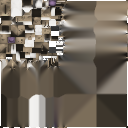 | 귀상어 | HP가 매우 높으며, 잡기 어려운 최상급 물고기 |
|  | 청새치 | |
| 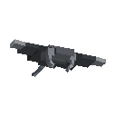 | 대왕가오리 | |

### A급

| | 이름 |
| --- | --- |
| 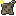 | 가오리 |
|  | 해파리 |
|  | 랍스터 |
|  | 장어 |
| 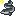 | 연어 |
|  | 참치 |

### B급

| | 이름 |
| --- | --- |
|  | 베스 |
| 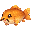 | 잉어 |
|  | 헤마 |
|  | 열대어 |
| 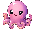 | 쭈꾸미 |
|  | 개불 |
|  | 금붕어 |
| 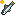 | 멸치 |
| 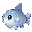 | 개복치 |
|  | 불가사리 |
| 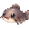 | 메기 |

### C급

| | 이름 |
| --- | --- |
| 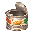 | 빈깡통 |
|  | 독개구리 |
| 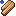 | 나무판자 |
|  | 청개구리 |
|  | 송사리 |
|  | 쓰레기 봉투 |
|  | 캔콜라 |


행운 스탯이 높은 낚싯대를 사용하면 높은 등급의 물고기가 잡힐 확률이 올라갑니다.

