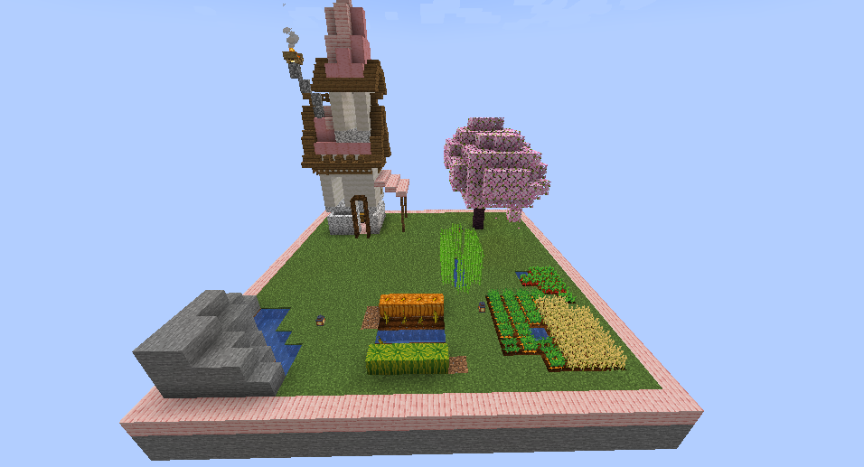
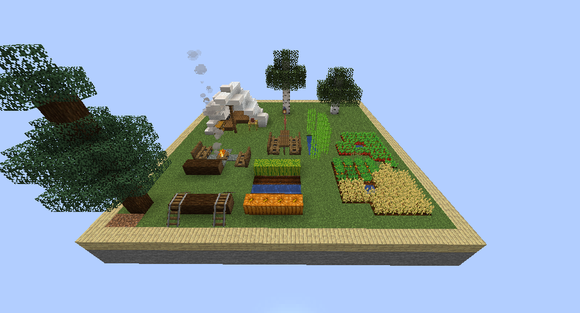

# 농장 미리보기

## 농장 생성 방법

`/농장 생성 [농장이름]` 명령어를 사용하여 나만의 농장을 만들 수 있습니다.

농장이 생성되면 기본 크기의 섬이 주어지며, 업그레이드를 통해 확장할 수 있습니다.

<figure><figcaption></figcaption></figure>



<figure><figcaption></figcaption></figure>



<figure><figcaption></figcaption></figure>




<figure><figcaption></figcaption></figure>




농장 이름은 부적절한 단어가 포함될 수 없습니다. (서버 규칙 참고)

