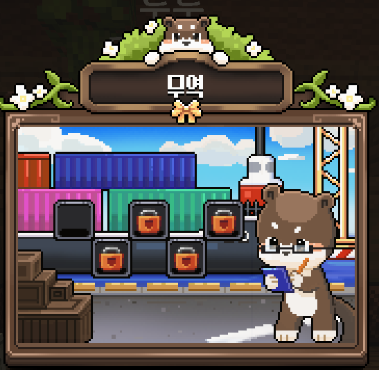

# ⛰️ 광산

광산은 메인 월드와 분리된 별도의 채굴 전용 월드입니다.\
`Shift + F` 메뉴에서 워프를 통해 광산으로 이동할 수 있습니다.

<figure><figcaption></figcaption></figure>

<figure><figcaption></figcaption></figure>

## 특징

* 수달농장만의 광물 분포를 유지합니다.
* 돌, 흙 등의 블록은 광산 월드에서만 얻을 수 있습니다.
* 채굴 스탯과 곡괭이 강화를 활용하여 효율적으로 채굴할 수 있습니다.
* 광산 월드는 **매일 오전 3시**에 초기화됩니다.


초기화 시 광산에 있는 플레이어는 자동으로 스폰으로 이동됩니다.


## 광물 분포

| 광물    | 최소 높이 | 최대 높이 |
| ----- | ----- | ----- |
| 석탄    | -64   | 128   |
| 철     | -64   | 64    |
| 구리    | -64   | 96    |
| 금     | -64   | 32    |
| 청금석   | -64   | 32    |
| 다이아몬드 | -64   | 16    |
| 에메랄드  | -16   | 256   |
| 고대 잔해 | -64   | 0     |

## 특수 드롭

채굴 중 확률적으로 특수 아이템이 드롭될 수 있습니다.

| 아이템      | 기본 드롭 확률 | 용도                  |
| -------- | -------- | ------------------- |
| 수달석      | 1%       | 인첸트 강화 재료 (성공률 45%) |
| 윤기나는 수달석 | 0.024%   | 인첸트 강화 재료 (성공률 65%) |


곡괭이 초월 등급이 높을수록 특수 드롭 확률이 증가합니다.\
윤기나는 수달석은 **초월 I 이상** 곡괭이에서만 드롭됩니다.

