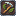

# 🌾 농사 스킬

농사 스탯은 작물을 수확하면서 경험치를 얻고, 스킬을 배워 수확 효율을 높이는 시스템입니다.\
`/채집스탯` 명령어로 확인할 수 있습니다.

<figure><figcaption></figcaption></figure>

## 작물별 기본 경험치

| 작물   | 경험치 |
| ---- | --- |
| 밀    | 4   |
| 당근   | 4   |
| 감자   | 4   |
| 비트   | 4   |
| 네더와트 | 5   |
| 코코아  | 5   |
| 수박   | 6   |
| 호박   | 6   |
| 사탕수수 | 3   |

## 스킬 목록

###  1. 풍성한 수확

작물 수확 시 추가 드롭 확률이 증가합니다.

| 레벨   | 효과   |
| ---- | ---- |
| Lv.1 | +15% |
| Lv.2 | +30% |
| Lv.3 | +45% |
| Lv.4 | +60% |
| Lv.5 | +75% |

###  2. 연쇄 수확

작물 수확 시 주변의 다 자란 작물도 함께 수확합니다.\
레벨이 높을수록 연쇄 범위가 넓어집니다.

###  3. 경험 수확

농사 경험치 획득량이 증가합니다.

| 레벨   | 효과   |
| ---- | ---- |
| Lv.1 | +12% |
| Lv.2 | +24% |
| Lv.3 | +36% |
| Lv.4 | +48% |
| Lv.5 | +60% |

### 4. 황금 밭


**해금 조건**: 풍성한 수확, 연쇄 수확, 경험 수확 스킬이 모두 **Lv.5**에 도달해야 합니다.


작물 수확 시 확률적으로 희귀 아이템이 드롭됩니다.\
(황금 당근, 반짝이는 수박 조각, 호박 파이 등)

| 레벨   | 드롭 확률 |
| ---- | ----- |
| Lv.1 | 2%    |
| Lv.2 | 4%    |
| Lv.3 | 7%    |
| Lv.4 | 11%   |
| Lv.5 | 16%   |
