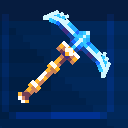
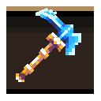

# 💎 캐시 상점

`/캐시상점` 또는 `/cashshop` 명령어로 캐시 상점을 열 수 있습니다.\
캐시는 [후원](../inquiries/donation.md)을 통해 충전할 수 있으며, `/캐시` 명령어로 잔액을 확인할 수 있습니다.


캐시 상점의 아이템은 후원 캐시로만 구매할 수 있습니다.


## 장비

|                                                   | 아이템          | 캐시 가격     |
| ------------------------------------------------- | ------------ | --------- |
|      | \[수달] 스타 도끼  | 13,000 캐시 |
|  | \[수달] 스타 곡괭이 | 10,000 캐시 |
|      | \[수달] 스타 괭이  | 13,000 캐시 |

## 발광 포션

발광 포션을 사용하면 캐릭터에 색깔 발광 효과가 적용됩니다.

|                                             | 아이템         | 캐시 가격    |
| ------------------------------------------- | ----------- | -------- |
|   | 빨간 발광 포션    | 9,000 캐시 |
|   | 주황 발광 포션    | 9,000 캐시 |
|   | 노란 발광 포션    | 9,000 캐시 |
|   | 밝은 초록 발광 포션 | 9,000 캐시 |
|   | 초록 발광 포션    | 9,000 캐시 |
|   | 파란 발광 포션    | 9,000 캐시 |
|   | 하늘색 발광 포션   | 9,000 캐시 |
|   | 자두 발광 포션    | 9,000 캐시 |
|   | 보라 발광 포션    | 9,000 캐시 |
|   | 흰 발광 포션     | 9,000 캐시 |
|  | 검정 발광 포션    | 9,000 캐시 |
|  | 무지개 발광 포션   | 9,000 캐시 |

## 색깔 채팅

채팅 색상을 변경할 수 있는 아이템입니다.

|                                              | 아이템   | 캐시 가격    |
| -------------------------------------------- | ----- | -------- |
|  | 청록 채팅 | 5,000 캐시 |
|  | 하늘 채팅 | 5,000 캐시 |
|  | 초록 채팅 | 5,000 캐시 |
|  | 주황 채팅 | 5,000 캐시 |
|  | 핑크 채팅 | 5,000 캐시 |

## 유틸리티

|                                             | 아이템        | 캐시 가격     | 설명                     |
| ------------------------------------------- | ---------- | --------- | ---------------------- |
|        | 플라이 무제한권   | 11,000 캐시 | 비행 시간 제한 없이 사용 가능      |
|  | 자동심기 무제한권  | 12,000 캐시 | 자동심기 시간 제한 없이 사용 가능    |
|        | 한글 닉네임 변경권 | 10,000 캐시 | 한글 닉네임을 1회 변경할 수 있는 쿠폰 |

## 강화 재료

|                                                     | 아이템      | 캐시 가격  | 설명                           |
| --------------------------------------------------- | -------- | ------ | ---------------------------- |
|         | 수달석      | 100 캐시 | 인첸트 강화 1\~10등급 재료 (성공률 45%)  |
|  | 윤기나는 수달석 | 300 캐시 | 인첸트 강화 11\~20등급 재료 (성공률 65%) |
