# 🧸 치장 아이템

`/치장` 또는 `/코스튬` 명령어로 치장 메뉴를 열 수 있습니다.


치장 아이템은 착용 전 **미리보기**(30초)를 통해 확인할 수 있습니다.


## 수달 세트 뽑기

[캐시 상점](cashshop.md)에서 **수달 세트 뽑기**(3,900 캐시)를 구매하여 아래 아이템 중 하나를 획득할 수 있습니다.

<figure><figcaption></figcaption></figure>

### 작은 수달 방어구

|                                                    | 아이템       |
| -------------------------------------------------- | --------- |
|      | 작은 수달 투구  |
| 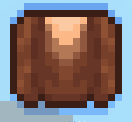 | 작은 수달 흉갑  |
| 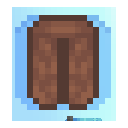   | 작은 수달 레깅스 |
| 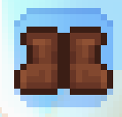      | 작은 수달 부츠  |

### 작은 수달 도구

|                                                     | 아이템       |
| --------------------------------------------------- | --------- |
| 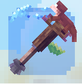         | 작은 수달 괭이  |
| 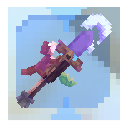      | 작은 수달 삽   |
| 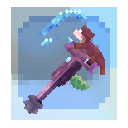         | 작은 수달 도끼  |
| 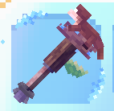     | 작은 수달 곡괭이 |
| 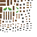 | 작은 수달 낚싯대 |

### 수달 도구 (희귀)

|                                                      | 아이템    |
| ---------------------------------------------------- | ------ |
| 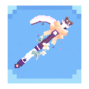         | 수달 괭이  |
| 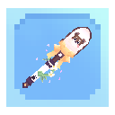      | 수달 삽   |
| 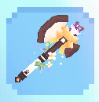         | 수달 도끼  |
| 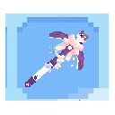     | 수달 곡괭이 |
| 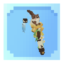 | 수달 낚싯대 |

### 특별 보상 (최희귀)

|                                                    | 아이템      | 설명                |
| -------------------------------------------------- | -------- | ----------------- |
| 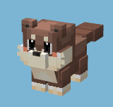 | 제작수달 자석펫 | 드롭 아이템을 자동 수집하는 펫 |
| 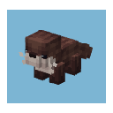 | 슬리피 수달 펫 | 귀여운 수달 펫          |

## 펫

`/펫` 명령어로 펫을 소환하거나 관리할 수 있습니다.\
자석펫은 플레이어를 따라다니며, 주변의 **드롭 아이템을 자동으로 수집**합니다.


펫마다 수집 범위와 속도가 다를 수 있습니다.

