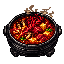

# 💵 아이템 시세


시세는 상황에 따라 변동될 수 있습니다.\
시세표에 기재되지 않은 아이템은 자유롭게 거래가 가능하지만, 터무니없는 가격에 거래할 경우 처벌될 수 있습니다.


## 작물 시세

### 기본 농작물

| 아이템               | 가격   |
| ----------------- | ---- |
| 감자                | 2원   |
| 당근                | 2원   |
| 호박                | 13원  |
| 수박                | 1원   |
| 수박 블록 (섬세한 손길 필요) | 14원  |
| 밀                 | 12원  |
| 비트                | 14원  |
| 코코아 콩             | 12원  |
| 고추                | 2원   |
| 사탕수수              | 5원   |
| 건초더미              | 54원  |
| 구운 감자             | 2원   |
| 독감자               | 100원 |

### 압축 농작물

압축 시 원단가 × 64 × 1.10 (10% 보너스)

| 아이템        | 가격     |
| ---------- | ------ |
| \[압축]감자    | 141원   |
| \[압축]당근    | 141원   |
| \[압축]고추    | 141원   |
| \[압축]호박    | 915원   |
| \[압축]수박 블록 | 986원   |
| \[압축]밀     | 422원   |
| \[압축]수박    | 71원    |
| \[압축]사탕수수  | 352원   |
| \[압축]건초더미  | 3,802원 |

### 채집 작물

|                                            | 아이템  | 가격   |
| ------------------------------------------ | ---- | ---- |
|     | 토마토  | 200원 |
|       | 옥수수  | 200원 |
|   | 가지   | 200원 |
|     | 마늘   | 200원 |
|  | 파인애플 | 200원 |
|      | 포도   | 200원 |
|    | 양배추  | 200원 |

## 물고기 시세

### S급 — 500,000원 (유저 거래 최대 시세 560,000원)

|                                                | 아이템   |
| ---------------------------------------------- | ----- |
|  | 귀상어   |
|      | 청새치   |
|    | 대왕가오리 |

### A급 — 20,000원 (유저 거래 최대 시세 200,000원)

|                                               | 아이템 |
| --------------------------------------------- | --- |
|       | 참치  |
|     | 연어  |
|        | 장어  |
|    | 랍스터 |
|  | 해파리 |
|   | 가오리 |

### B급 — 2,000원 (유저 거래 최대 시세 2,600원)

|                                                 | 아이템  |
| ----------------------------------------------- | ---- |
|  | 개불   |
|         | 잉어   |
|         | 헤마   |
|      | 개복치  |
|      | 멸치   |
|     | 금붕어  |
|      | 쭈꾸미  |
|     | 열대어  |
|    | 불가사리 |
|     | 메기   |
|         | 베스   |

### C급 — 500원

|                                                | 아이템   |
| ---------------------------------------------- | ----- |
|        | 캔콜라   |
|         | 빈깡통   |
|  | 독개구리  |
|   | 나무판자  |
|    | 청개구리  |
|      | 송사리   |
|    | 쓰레기봉투 |

## 정육 시세

### S급 — 500,000원 (유저 거래 최대 시세 560,000원)

|                                                    | 아이템   |
| -------------------------------------------------- | ----- |
|  | 한우 안심 |
|     | 한우 등심 |

### A급 — 20,000원 (유저 거래 최대 시세 200,000원)

|                                                   | 아이템     |
| ------------------------------------------------- | ------- |
|      | 차돌박이    |
|          | LA갈비    |
|  | 흑돼지 삼겹살 |
|       | 오리 가슴살  |
|       | 갈매기살    |
|         | 양갈비     |

### B급 — 2,000원 (유저 거래 최대 시세 2,600원)

|                                                  | 아이템   |
| ------------------------------------------------ | ----- |
|        | 돼지 목살 |
|       | 삼겹살   |
|  | 오겹살   |
|   | 닭가슴살  |
|      | 닭다리살  |

### C급 — 800원

|                                          | 아이템 |
| ---------------------------------------- | --- |
|  | 소시지 |
|    | 베이컨 |
|      | 햄   |

## 기름 교환 방법

기름은 **자란 작물 5개를 교환**하여 획득합니다. (교환 조리 시간: 30초)

|                                               | 아이템     | 교환 재료   |
| --------------------------------------------- | ------- | ------- |
|     | 토마토 기름  | 토마토 x5  |
|       | 옥수수 기름  | 옥수수 x5  |
|   | 가지 기름   | 가지 x5   |
|      | 포도 기름   | 포도 x5   |
|     | 마늘 기름   | 마늘 x5   |
|  | 파인애플 기름 | 파인애플 x5 |
|    | 양배추 기름  | 양배추 x5  |

## 인챈트 강화 재료 시세

|                                                     | 아이템      | 유저 거래 최대 시세 |
| --------------------------------------------------- | -------- | ----------- |
|         | 수달석      | 20,000원     |
|  | 윤기나는 수달석 | 300,000원    |

## 장비 재료 시세

| 아이템      | 유저 거래 최대 시세 |
| -------- | ----------- |
| 네더라이트 형판 | 100,000원    |
| 섬손 스크롤   | 100,000원    |

## 요리 시세

요리 가격은 매일 오전 1시에 초기화되며, 아래는 상점 판매 가격 범위입니다.

### S등급

|                                                          | 요리             | 최저 판매가격  | 최고 판매가격  |
| -------------------------------------------------------- | -------------- | -------- | -------- |
|  | 한우 안심 스테이크     | 693,344원 | 713,441원 |
|      | 상어 수제비 전골      | 696,258원 | 716,440원 |
|   | 한우 등심 호박찜      | 696,548원 | 716,738원 |
|    | 청새치 가지 수박 그릴   | 696,842원 | 717,040원 |
|   | 대왕가오리 호박 포도 솥밥 | 696,548원 | 716,738원 |

### B등급

|                                                                  | 요리            | 최저 판매가격  | 최고 판매가격  |
| ---------------------------------------------------------------- | ------------- | -------- | -------- |
|          | 삼겹살 마늘 볶음     | 9,058원  | 9,321원  |
|          | 쭈꾸미 수박 카르파초   | 15,103원 | 15,540원 |
|                  | 멸치 포도 포케      | 10,438원 | 10,741원 |
|               | 메기 사과 조림      | 10,438원 | 10,741원 |
|         | 삼겹살 양배추 구이    | 14,111원 | 14,520원 |
|          | 닭가슴살 파인애플 샐러드 | 9,253원  | 9,521원  |
|               | 잉어 가지찜        | 10,633원 | 10,941원 |
|             | 목살 옥수수 스테이크   | 12,323원 | 12,681원 |
|           | 베스 토마토 매운탕    | 44,988원 | 46,292원 |
|              | 개복치 베리 스테이크   | 44,988원 | 46,292원 |
|  | 열대어 파인애플 세비체  | 16,463원 | 16,941원 |

### C등급

|                                                            | 요리           | 최저 판매가격 | 최고 판매가격 |
| ---------------------------------------------------------- | ------------ | ------- | ------- |
|  | 소시지 토마토 볶음밥  | 3,789원  | 3,899원  |
|     | 수박 포도 화채     | 10,786원 | 11,099원 |
|            | 햄 토마토 수프     | 3,789원  | 3,899원  |
|        | 베이컨 옥수수 샌드위치 | 5,860원  | 6,029원  |

### 압축블록 요리

|                                                                | 요리            | 최저 판매가격   | 최고 판매가격   |
| -------------------------------------------------------------- | ------------- | --------- | --------- |
|  | 압축 고추 전골      | 32,071원  | 33,001원  |
|     | 압축 코코아 작물 케이크 | 138,676원 | 142,696원 |
